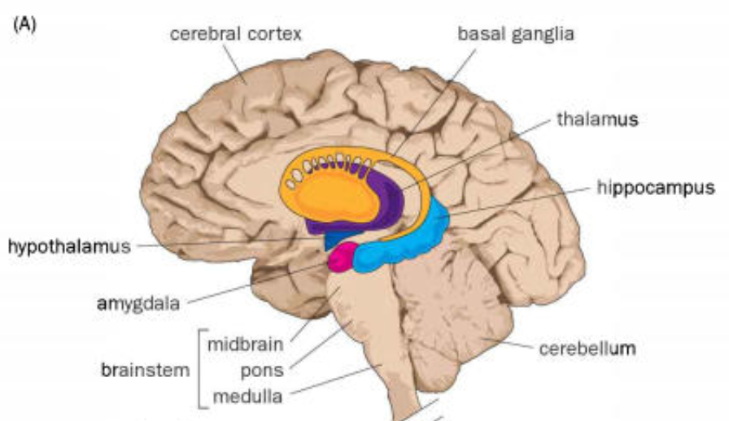
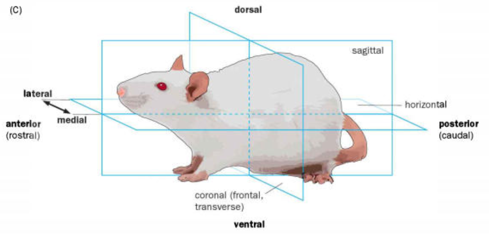
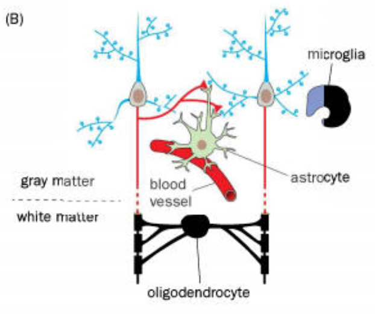
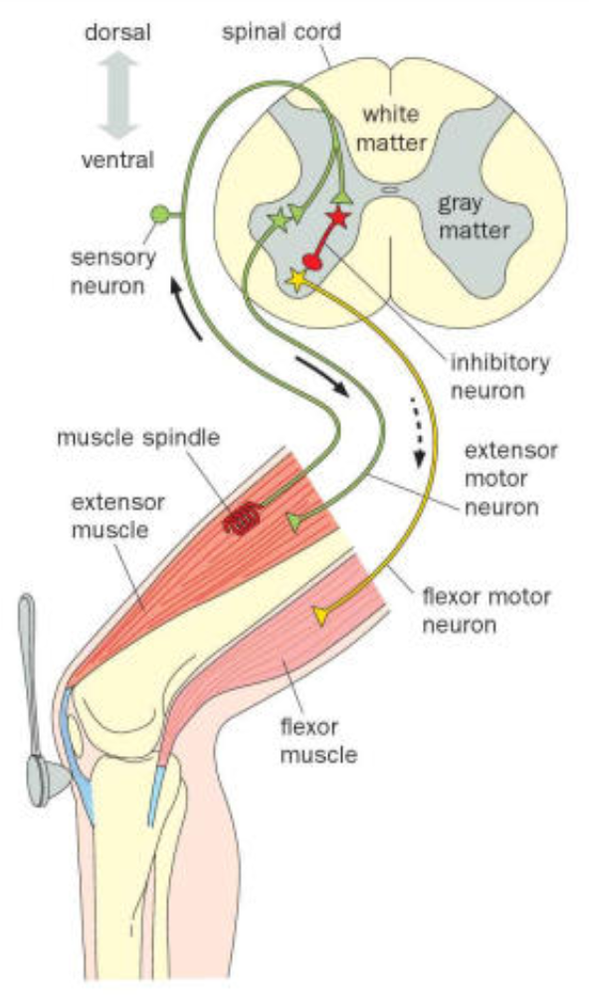
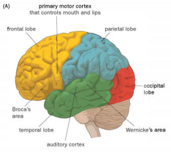
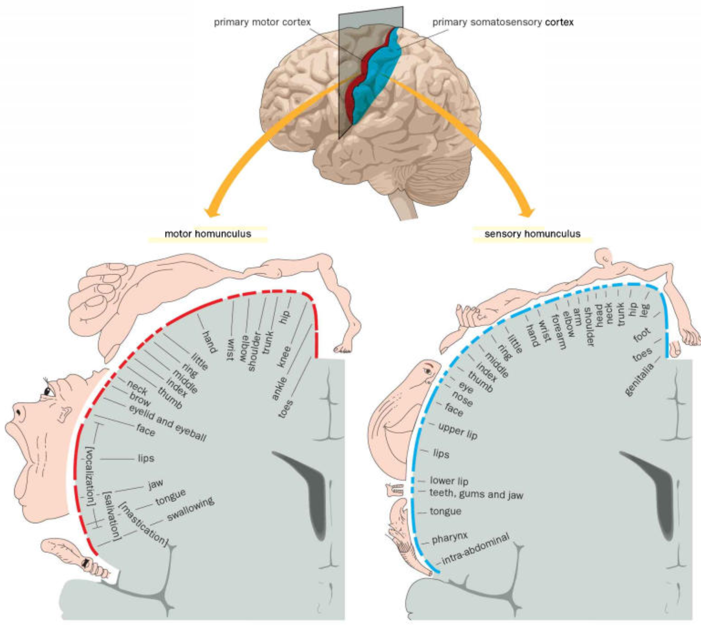

# An Invitation to Neurobiology

## How Is The Nervous System Organized?
* For all vertebrate and invertebrate animals, the nervous system can be divided into the **central nervous system** and the **peripheral nervous system**. 
* The (vertebrate) CNS consists of the **brain** and **spinal cord**.
* Morphological regions of the brain: cerebral cortex, basal ganglia, thalamus, hippocampus, amygdala, hypothalamus, cerebellum, midbrain, pons, and medulla. These regions are shown below. 

* The **brain stem** consists of the midbrain, pons, and medulla. 
* The peripheral nervous system consists of nerves (discrete bundles of axons) that connect the brainstem and spinal cord of the CNS with the body and internal organs. Furthermore, it also consists of isolated **ganglia** (clusters of nerve cells) outside the brain and spinal cord. 
* Histological sections: **sagittal plane** (splits animal in half), **coronal plane** (splits animal between front an back), and **horizontal plane** (splits animal between top and bottom). All are shown below. 

* The **rostral-caudal**/**anterior-posterior** axis goes from nose to bottom, and curves along with the central nervous system (applicable to animals such as primates whose heads are out of line with their bodies). 
* The **dorsal-ventral** axis goes from back to stomach and also curves with the spinal cord/brain. 
* The **lateral-medial** axis goes from outside to inside and lies along the horizontal plane. 

### The nervous system consists of neurons and glia
* Two types of cells in the nervous system: **neurons** (nerve cells) and **glia**.
* A neuron has two types of **neuronal processes**: (1) a long thin process called an **axon** that can extend far beyond the **soma** (cell body) and (2) **dendrites**, which are thick, bushy processes and usually close to the soma. 
* At the ends of dendrites are small protrusions called **dendritic spines**, which participate in the transfer of information. These, along with the neuronal processes are shown in the figure below.

* There are four major types of glia: **oligodendrocytes**, **Schwanncells**, **astrocytes**, and **microglia**. 

* **Oligodendrocytes** and **Schwann cells** typically wrap axons with myelin sheath, to increase the speed of action potential propagation. They constitute the white matter in the brain. An example oligodendrocyte is shown in the figure above.
* **Astrocytes** play a role in the development and regulation of neuronal communication and are present in the grey matter of the CNS. An example astrocyte is shown above.
* **Microglia** are the resident immune cells of the nervous system, and engulf damaged cells and debris while reorganizing neuronal connections. 

## Individual neurons were first visualized by Golgi staining in the late nineteenth century
* The cellular organization of the brain was not agreed upon even until the early 20th century, despite the fact that it was understood that the cell was the fundamental unit of living organisms (the cell theory). 
* In the nervous system, there were proponents (such as Camillo Golgi) of the **reticular theory**, which regarded the entire reticulum of nerve cells linked together as the working unit of the nervous system. 
* Santiago Ramon y Cajal refuted the reticular theory, instead supporting the **neuron doctrine**, which postulated that neuronal processes do not fuse to form a reticulum. Rather, neurons are the fundamental units of the nervous system, and communicate to each other via neuronal processes.
* Camillo Golgi invented the **Golgi staining** method, which allowed scientists to see the individual neurons. Golgi staining consists of soaking a piece of neural tissue in a solution of silver nitrate and potassium dichromate in the dark for several weeks. A black precipitate (crystals of the silver chromate) form randomly in a fraction of these cells so that they can be viewed against the unstained background. 

## Twentieth-century technology confirmed the neuron doctrine
* Evidence for the neuron doctrine: 
    1. During embryonic development, neurons start out just having cell bodies, and axons grow from there to their final destinations. 
    2. **electron microscopy**, a technique which allows the visualization of structures with nanometer resolution; this allowed the observation of **chemical synapses**, and the **synaptic celft**, which separates the neuron from its target. 
* Neurons also communicate via **electrical synapses**, mediated by **gap junctions** between neurons. In these cases, gap junction channels directly connect the cytoplasm of two adjacent neurons, allowing ions and small molecules to travel from one neuron to the next. 

## In vertebrate neurons, information generally flows from dendrites to cell bodies to axons
* Some example neurons:
    * **Pyramidal neurons** have a pyramid shaped cell body with an apical dendrite and several basal dendrites that branch extensively. 
    * **Basket cells** wrap their axon terminals around the cell bodies of pyramidal cells in the cerebral cortex. 
    * **Purkinje cells** are located in the cerebellum.
    * **Motor neurons** extend bushy dendrites within the spinal cord and projects its axon out of the spinal cord and into the muscle. 
* The **theory of dynamic polarization**, posed by Ramon y Cajal, states that the transmission of a neuronal signal takes places from dendrites and cell bodies to the axon. 

## Neurons use membrane potential changes and neurotransmitter release to transmit information
* Lord Edgar Adrian and his colleagues found that individual nerve impulses were of a uniform size and shape whether they were elicited by weak or strong sensory stimuli. 
* **Graded potentials**, or **local potentials** are another important form of communication. For example, **synaptic potentials** result at the postsynaptic sites in response to neurotransmitter release by presynaptic partners. 
* The **initial segment of the axon** is where the action potential is first generated; this implies that information from the dendrites must be passed along through here. This, however, is not always true as action potentials can be generated elsewhere. 

## Neurons function in the context of specific neural circuits
* **Afferents** are axons that project from peripheral sensory neurons to the CNS. **Efferents** are axons that project from the CNS to peripheral targets.
* **Excitatory neurons** fire action potentials that are likely to make their postsynaptic target neurons fire action potentials. 
* **Knee jerk neural circuit:** 
    * In the leg, there's an **extensor muscle** (whose contraction will extend the knee joint) and the **flexor muscle** (whose contraction will prevent extension of the knee joint). 
    * Thus, in order for someone's leg to bounce up (like in the classical knee jerk), the extensor muscle must flex and the flexor muscle must not. 
    * There are muscle spindles in the extensor that inform sensory neurons that the knee has been tapped; the **sensory neurons** excite **motor neurons** in the spinal cord that further excite the extensor muscle and cause it to contract. 
    * At the same time, the sensory neurons excite **inhibitory interneurons**, which inhibit the flexor muscle. 
    * Thus, the net result is that the extensor contracts and the flexor does not, producing a knee jerk. 
 <b>The Knee-Jerk Neural Circuit</b>

## Specific brain regions perform specialized functions
* **Phrenology**, developed by Franz Joseph Gall, posits that regions of the brain are specialized for behavior. The centers for each mental function grow with use, resulting in bumps and ridges on the skull. Gall and his supporters attempted to use the shape of these bumps and ridges on a person's skull to deduce their personality and traits. 
* Each hemisphere of the brain is divded into four lobes: the **frontal lobe**, **parietal lobe**, **temporal lobe**, and the **occipital lobe**. 
 <b>Lobes of the brain</b>

* In the 1860s, Paul Broca discovered lesions in the left frontal lobe (near the primary motor cortex) in patients who couldn't speak. Patients who had lesions in **Broca's area** had trouble producing language, in speech or writing, but could still understand language. Meanwhile, patients with lesions **Wernicke's area**, discovered by Karl Wernicke, have trouble understanding language but can speak it fluently (although unintelligbly). 
* **Functional magnetic resonance imaging (fMRI)** monitors signals originating from changes in blood flow that are closely related to local neuronal activity. Thus, fMRI can be used to observe active regions of the brain while patients perform certain tasks, shedding light on the functional divisions in the brain. 

## The brain uses maps to organize information
* The nervous system uses maps to organize information. Two examples are the **motor homunculus** and the **sensory homunculus**, discovered through electrical stimulation during brain surgeries to treat epilepsy. If we stimulate nearby neurons in these homunculi, nearby body parts will move or feel sensation, respectively. 
* Thus, the homunculi are indicative of a **topographic map**. This map is not uniform: specific body parts (such as the hands and fingers) exhibit larger representation in both the motor and sensory maps.
 <b>Sensory and Motor Homunculus</b>

## The brain is a massively parallel computing device
* Computers and brains are similar in that both contain a very large number of fundamental units ($\sim 10^9$ transistors, $\sim10^{11}$ neurons). However, computers have much greater speed and precision when it comes to basic operations. A computer can perform up to $10^{10}$ operations per second, while the fastest action potentials max out at 1000 Hz. Furthermore, computers are very precise, while the brain suffers from variability to a few percent due to biological noise. 
* The brain has huge advantages, however, when it comes to its parallel processing ability. Computers largely utilize **serial processing**, by which instructions are completed sequentially. The brain, while exhibiting global serial processing (information flows from sensory inputs to the brain, for example), can process information in parallel. 
* Computers operate a digital code (binary), while the brain uses both digital aspects (spikes) and analog codes (membrane potentials and synaptic weights).
* Lastly, the brain is plastic - it can change its wiring and connectivity strengths to learn and adapt to new environments and settings. 

# General Methodology

## Observations and measurements are the foundations for discovery

## Perturbation experiments establish causes and mechanisms
* **Perturbation experiments** alter some parameters in a biological system and observe the consequences, which can inform us how the system operates. Specifically, there's **loss-of-function** experiments, in which we remove a key component of the system to see if it's relevant for some function. Lesion studies are an example of a loss-of-function experiment. Furthermore, there's **gain-of-function** experiments, where a specific component is added to a system. For example, electrical stimulation of neurons can show what functions or behaviors these neurons are sufficient to produce. 
* Loss-of-function experiments tell us whether a component is *necessary* for function. Gain-of-function experiments tell us whether a component is *sufficient* for function. We need both necessity and sufficiency to prove a functional relationship. 