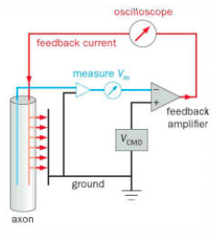

# Signaling within Neurons

## Cell Biological and Electrical Properties
* **Central dogma** of molecular biology: information flows from DNA$\rightarrow$RNA$\rightarrow$proteins. 
* **Genes**, which carry genetic information on how to create RNA and protein, are located in **DNA** molecules. 
* A substance called RNA polymerase uses DNA as a template to synthesize a single-stranded copy (in which thymidine is replaced with uracil) in a process called **transcription**. This results in RNA called pre-messenger RNA (**pre-mRNAs**), which then undergo a series of RNA processing steps. Some include **capping** (adding a modified nucleotide to one end of the RNA), **RNA splicing** (removing RNA sequences that aren't informative about protein manufacturing called **introns**), and **polyadenylation** (adding a long sequence of adenosine nucleotides to the RNA's 3' end). After this processing, we have mature **messenger RNAs** (mRNAs). 
* The mRNA is exported to the cytoplasm at which point it's decoded by ribosomes to produce proteins (**translation**). Translation occurs either in the free cytoplasm or in the **endoplasmic reticulum** (ER). The proteins created in the ER are typically transported out of the cytoplasm via **intracellular vesicles**. When the vesicle fuses with the membrane to release the protein (or whatever is in the vesicle), it's called **exocytosis**. 
* Meanwhile, the cell can undergo **endocytosis**, where extracellular substances can be absorbed by creating vesicles in the membrane. These vesicles that are part of endocytosis typically travel through **endosomes**, which can either recycle the material (send it back to the extracellular matrix) or pass them on to **lysosomes**, which will degrade the proteins.
* How do these rules fit in with neurons? Neurons typically follow the central dogma along with the above processes, but have special rules because of their distinct structure including the large size and extensive dendritic extensions. 
* One thing neurons have to be worried about: how do specific proteins make it to the axon terminal or dendritic tips, when neurons tend to be quite large? There are two options: the mRNA can go to the final destination and then be translated into proteins, or the proteins can travel directly from the soma. 

### While some dendritic and axonal proteins are synthesized from mRNAs locally, most are actively transported from the soma
* **Local protein synthesis**, where proteins are created outside the soma in the locations that they function, has been observed in dendrites. Electron microscopy studies and **in situ hybridization** (which determines the mRNA distribution in cells) have identified specific mRNAs in dendrites. 
* Local protein synthesis can be useful because it allows for proteins to be created where they function without the need for their transport. Furthermore, it allows for local regulation of proteins in the dendritic tree.
* Proteins are also synthesized in the soma. To study this furthermore, radioactive amino acids were placed in the soma to be synthesized into proteins. Later, the proteins were detected in the axon via gel electrophoresis. 
* The amino acid studies identified two major groups of proteins: those that follow **fast axonal transport** (50 - 400 mm per day) and those that follow **slow axonal transport** (0.2 - 8 mm per day).
* Theoretical studies indicate that these transport modes are too fast to be passive transport, suggesting that they are active processes.

### The cytoskeleton forms the basis of neuronal polarity and directs intracellular trafficking
* Similar to other eukaryotic cells, neurons rely on two major cytoskeletal elements for structural integrity and motility - **filamentous actin**, or **F-actin**/**microfilaments**, and **microtubules**. F-actin consists of two helical strands of actin polymers while microtubules are cylinders of actin polymers. F-actin has a plus end and a minus end with distinct properties. 
* F-actin, or microfilaments, are mostly concentrated at peripheral sites like the axonal or dendritic processes and the presynaptic terminals/postsynaptic sites. 
* Microtubules, on the other hand, fill the center of the axonal and dendritic processes. Long distance transport occurs along the microtubules. 
* **Neuronal polarity** refers to the distinction between axons and dendrites. Information in neurons typically flows from the dendrites to the axons.
* Dendrites and axons differ in their microtubule orientations. Microtubules in axons orient their plus side away from the soma ('plus-end-out' rule) while in dendrites they orient their plus side both toward and away from the soma.
* Two proteins move cargo along the microtubules: **kinesin** and **dynein**. In axons, dyneins direct minus-ended cargo transport while kinesins typically direct plus-ended cargo transport. In dendrites, both can direct transport in either direction. 
* While microtubules are very important in the transport of cargo over long distances, they are not found in dendritic spines and presynaptic terminals. Instead, the F-actins take over, utilizing the **myosin** family of proteins for transport. 

### Channels and transporters move solutes passively or actively across neuronal membranes
* How do molecules move inside and outside the cell, across the lipid bilayer? Molecules that are soluble in water (**solutes**), such as inorganic ions, nutrients, metabolites, and neurotransmitters cannot permeate the lipid bilayer due to the hydrophobic tails. Thus, transport for solutes must occur by other means. 
* There are two major classes of membrane transporters: **channels** and **transporters**. Channels allow the transport of specific solutes (such as ion channels) through an aqueous pore. Transporters have separate gates that open and close sequentially, which move solutes from one side of the membrane to the other side. 
* The direction and magnitude of solute movement across channels is dictated by both the **chemical gradient** and **electrical gradient** (together, the electrochemical gradient). Transport down the electrochemical gradient does not require external work and thus is referred to as **passive transport**. 
* On the other hand, in **active transport**, molecules move against the electrochemical gradient (with the use of external energy) through a transporter. The required external energy can come from various sources, including: (1) Chemical reactions, such as ATP hydrolysis; (2) Light, such as photon absorption; and (3) Coupled transport, where the energy from moving a solute down a gradient is used to move another solute against a gradient. Coupled transporters (**cotransporters**) consist of **symporters**, which move the two species in the same direction, and **antiporters** (**exchangers**) that move the solutes in opposite directions. 

### Neurons are electrically polarized at rest because of ion concentration differences across the plasma membrane and differential ion permeability
* The **membrane potential** is the difference in electric potential between the inside of the cell and the outside of the cell. 
* The way we record the membrane potential is through an **intracellular recording**. To do this, we insert a microelectrode (usually made of glass with a fine tip that's filled with a conducting salt solution) that measures the potential difference between the inside and outside of the cell. Typically, the **resting potential** is around -50 mV to -80 mV (depending on the cell type). 
* Three major ions contributing to the resting potential: Na+, Cl-, and K+. 
* The fact that the rest potential is nonzero implies that cells are polarized. Polarization arises due to (1) differences in ion concentrations between the intracellular and extracellular environments and (2) differences in **permeability** of the membrane to each of the three major ions.
* Na+ and Cl- are more concentrated (10-20 times) in the extracellular environment than the intracellular environment. Meanwhile, K+ is more concentrated (30 times) in the intracellular environment than the extracellular environment. 
* Furthermore, the membrane is typically more permeable to K+ than Na+ and Cl-. 
* The **Na+-K+ ATPase** pump is the main transporter for the major ions. It uses ATP hydrolysis to pump Na+ outward and K+ inward (against the chemical gradient). Thus, the pump maintains the large concentration gradients found in the resting potential state. Furthermore, the **K+-Cl- cotransporter** maintains the Cl- gradient. 
* We can consider one ion at a time. Specifically, suppose the membrane only allows one ion (say K+) to pass through it. There's two factors at play: the large concentration of K+ inside the cell implies that K+ will want to flow out of the membrane. But if we keep pumping K+ outside the membrane, then eventually the ensuing electric field will cause K+ to want to rush back into the cell. The **Nernst equation** tells us the resting potential (called **equilibrium potential**) for each ion, assuming that ion is the only one that can traverse the membrane. The equilibrium potentials for each ion are -85 mV for K+, -79 mV for Cl-, and +58 mV for Na+. If we want to incorporate the effects of multiple permeable ions, we need to use the **Goldman-Hodgkin-Katz equation**. 

### Neuronal plasma membrane can be described in terms of electrical circuits
* Electrophysiology more often uses conductances (inverse resistance) rather than resistances. There's a couple reasons for this: it makes more sense to write Ohm's Law in terms of the current rather than voltage ($I = g R$ rather than $V = IR$) and conductances add for resistors in parallel, which is what happens more often for channels in the membrane. 
* The parallel RC-circuit is an excellent model for the cell membrane in neurobiology. Ion channels act like resistors in parallel (they allow charge to flow with some resistance) while the cell membrane acts like a capacitor (it enforces a charge separation and thus a voltage difference between the intracellular and extracellular compartments). 

### Electrical circuit models can be used to analyze ion flows across glial and neuronal plasma membrane
* Let's go back to the model where only K+ could flow across the membrane. We know that there's a potential difference across the membrane - $V_m$ - and that membrane potential will be equal to the equilibrium potential for K+ when no current is flowing across the membrane. Thus, since a voltage is enforced, we can model this in a circuit by a battery with voltage equal to the equilibrium potential. Furthermore, since the membrane is enforcing a charge separation, our circuit will also contain a capacitor. 
* But let's say that current starts flowing across the membrane via K+ ions. We need to add a resistor in our circuit to account for this. Thus, we'll place the resistor in series with the battery and in parallel with the capacitor. The battery is trying to enforce a voltage difference equal to $E_K$ and when current finally stops flowing through the resistor, it will be able to enforce that.
* Now, if we want to involve all three major ions, we need to expand our circuit to involve three different batteries and resistors. We keep one capacitor, however, because there's only one membrane. The membrane potential, then, will be determined by the equilibrium potentials of each battery along with the conductances of the ion channels. 

### Passive electrical properties of neurons: electrical signals evolve over time and decay across distance
* Here, we explore what happens to a change in current as it propagates down a fiber (in this case, to model an axon). An example experiment we can do is place a stimulating electrode inside the fiber along with a recording electrode. We also place recording electrodes down the fiber, as shown in the figure below.  
 <b>Passive Electrical Properties of Axons</b>

* The stimulating electrode pushes positive charge into the wire, which is shown by the current pulse in the first plot. The recording potential reads this as an increase in potential, but it increases slowly as the charge accumulates. Once the current stops flowing, the membrane potential slowly hyperpolarizes back to its original voltage. At later points in the fiber, the same thing happens: a slow increase followed by a slow decay. The difference now is that the changes occur later in time and are smaller in magnitude. 
* This system can be modeled by a series of RC circuits. Each segment of the membrane is divided by a resistor, as charge cannot propagate freely down the axon. Thus, this model explains why the membrane potential increases slowly as current is pumped into the fiber: the capacitor prevents rapid changes in the potential. Furthermore, when the current stops, the capacitor becomes discharged, but slowly. The model also explains why potentials down the fiber do not increase as much: the resistors in between segments of the fiber cause voltage drops, and the RC-circuits cause current to leak to the extracellular side.  
 <b>RC Circuit Model for Axon</b>

* The potential at a distance $x$ from the stimulating electrode is given by $$V(x) = V_0 \exp\left(-\frac{x}{\sqrt{d R_m/{4 R_i}}}\right),$$ where $\ell = \sqrt{\frac{dR_m}{4R_i}}$ is the **length constant**. Thus, the length constant increases with the membrane resistance $R_m$ (larger $R_m$ implies less leaking current) and fiber diameter $d$ (larger $d$ implies that there's more room for the current to travel through) and decreases with the axial resistance $R_i$ (larger $R_i$ means larger voltage drops across the fiber). 
* The model we consider here provides **passive electrical properties** of neurons, which detail how changes in potential passively propagate. Specifically, two of these properties are the time constant (RC constant), which detail the temporal spread of electrical signals, and the length constant, which details the attenuation across distance. 

### Active electrical properties of neurons: depolarization above a certain threshold produces action potentials
* The passive electrical properties of neurons imply that electrical signals will decay rapidly over longer distances. However, we see axons in biological systems that are quite long: so what exactly do they do to transmit electrical signals?
* The answer is that neurons must invoke **active electrical properties**. To be specific, they use **action potentials**, or **spikes**. An active potential occurs when the membrane potential is increased above a certain threshold (due to a large influx of current), at which point a large, transient increase in the potential occurs. Furthermore, recordings at electrodes down the fiber will also measure action potentials with similar shape and size. Biological systems therefore use action potentials to solve the problem of attenuating electrical signals. 
* A couple more details: a stimulus which evokes action potentials is called a **supra-threshold stimulus** while a stimulus that does not (it fails to cause the potential to reach threshold) is called a **sub-threshold stimulus**.
* Lastly, not all neurons or even biological systems use action potentials. For example, there are neurons in the retina which use graded potentials. Furthermore, *C. Elegans* is an example of a system which does not use spikes at all. 

## How do electrical signals propagate from the neuronal cell body to its axon terminals?

### Action potentials are initiated by depolarization-induced inward flow of Na+
* The squid's giant axon was the first place where the action potential was accurately measured. Measurements of the action potential in this system indicated that the membrane potential became positive and close to the reversal potential of sodium. This observation suggests that the increase in membrane potential is due to an influx of sodium ions because somehow the membrane becomes more permeable to sodium. 
* This hypothesis was tested by measuring action potentials in different extracellular solutions where the external concentration of sodium was changed. Below, the plot shows the membrane potential of an action potential in a normal extracellular solution (red), after the extracellular solution has a 2/3 decrease in sodium concentration (blue), and in a normal extracellular solution again (green). The magnitude of the action potential drops, lending support to the hypothesis. 
 <b>Changing the extracellular concentration of sodium alters the action potential</b>

### Sequential, voltage-dependent changes in Na+ and K+ conductances account for action potentials. 
* So what might be going on now? Perhaps, depolarization leads to an increase in membrane permeability to Na+ - this would lead to an increasing membrane potential, and generated a positive feedback loop. Testing this, however, requires measuring ion flows across the membrane in a controlled setting. The **voltage clamp** experiment achieved this goal. 
* In a voltage clamp experiment, the intracellular membrane is measured and compared to a **command voltage**, which is chosen by the experimenter. If the voltages disagree, a current is injected in the membrane to rapidly change it to the command voltage. This experiment is demonstrated in the figure below. The blue wire measures the membrane potential by comparing it to the ground. Then, the difference between the membrane potential and command voltage $V_{\text{CMD}}$ is measured by passing them through an op-amp. That difference is then amplified and used to pass a feedback current, shown by the red wire, into the axon. This process repeats until $V_m$ is equal to $V_{\text{CMD}}$.  
 <b>Voltage Clamp Experiment</b>

* Alan Hodgkin and Andrew Huxley used the voltage clamp in 1950 in a series of experiments. They changed the voltage of the membrane potential and measured the resulting flows of current across the membrane (without having the change in ion flow mess with the membrane potential due to the voltage clamp). Thus, they were able to measure the conductances $g_{\text{Na}}$ and $g_{\text{K}}$ at different membrane potentials $V_m$ ($=V_{\text{CMD}}$). They found that the sodium and potassium conductances increased when the intracellular membrane potential became more depolarized. This is shown in the figure below, which plots each conductance over time at different voltages. 
 <b>Sodium and Potassium Conductances</b>

* These experiments shed light on several principles of the action potential, listed here:
    * First, the rising phase of the action potential is caused by Na+ influx, and the Na+ influx is caused by a rapid increased in the Na+ conductance (see the left plot above, especially the higher voltages). 
    * Second, after the surge of Na+, the conductance would always decrease despite continued depolarization (see the later times of the left plot). This **inactivation** of Na+ conductance didn't depend on the command voltage. 
    * Third, depolarization also increased the conductance of K+, but the increase in conductance lagged behind the increase in conductance of Na+ (see right plot above).
    * Fourth, the Na+ and K+ conductances seemed to be independent of each other, but both depended on the membrane potential. 
* Overall, these results led to the idea of channels called **voltage-gated ion channels**, whose conductance changes as a function of the membrane potential. 
* **Summary of the action potential:** Here's a summary of the action potential. 
 <b>Action Potential</b>

    * First, the cell is depolarized. During the rising phase, voltage-gated Na+ ion channels open up, allowing more sodium to flow into the cell and further depolarizing it. 
    * Increase in sodium causes an efflux of K+ because the influx of positive charge creates a new electrochemical gradient. 
    * Then, the Na+ influx exceeds the K+ efflux, and the neuron will pass the threshold for an action potential.
    * At this point, the depolarization causes more voltage-gated ion channels to open, and the influx of Na+ causes the membrane potential to surge up. Meanwhile, voltage-gated ion channels start opening up for K+, causing them to be expelled from the cell.
    * At the peak of the action potential, the Na+ becomes inactivated, but K+ continues to be expelled from the cell. This causes the cell to repolarize to its resting potential. 

### Action potentials are all-or-none, are regenerative, and propagate unidirectionally in the axon
* Action potentials are **all-or-none**. That is, if depolarization brings the potential above the threshold, the action potential *will* occur. If it does not, there will be no action potential. 
* The shape of the action potential depends on the relative concentrations of Na+ and K+. Firing many action potentials won't really change these concentrations - the number of moles of Na+ and K+ involved in the firing of a neuron is tiny compared to the amount of ions available both intracellularly and extracellularly. Thus, we can be safe in assuming that the shape of action potentials are relatively constant.
* Action potentials are **regenerative**. When a portion of an axon becomes depolarized, a nearby segment will also become depolarized above threshold. Thus, that new segment of the axon will *also* produce an action potential, and this process repeats. The action potential is regenerated down the axon, which prevents the attenuation problem we discussed earlier. 
* However, by the above logic, we might expect the action potential to continue to spread in all directions on the axon. What prevents this, however, is both the inactivation of sodium ions and the delayed efflux of K+ ions. For example, you've got an action potential propagating down an axon, as shown below, from $Z\rightarrow A \rightarrow B$. The action potential is currently occurring at $A$ and just finished at $Z$. Why doesn't the depolarization at $A$ continue *back* toward $Z$? Because the Na+ voltage-gated ion channels are currently blocked at $Z$ and K+ is currently being expelled from the cell. In other words, there's a **refractory period**, where an action potential can't occur right after another. This ensures that the action potential proceeds **unidirectionally** down an axon.  
 <b>Refractory Periods and Action Potentials</b>

* That's not to say that action potentials *can't* go backwards. In fact, experimenters can stimulate actions potentials in a retrograde direction toward the cell body from the axon terminal. These are called **antidromic spikes**, but they don't typically occur physiologically *in vivo*. 
* Action potentials are great because they allow neurons to transmit information over long distances without attenuation. But because of the all-or-none property, the shape of an action potential doesn't really carry much information. Presumably, the information carried by action potentials is in the rate at which they're transmitted or the timing of their arrival.

### Action potentials propagate more rapidly in axons with larger diameters and in myelinated axons
* How quickly action potentials propagate down an axon depend on its physical properties. For example, we know the length constant is given by $\ell = \sqrt{dR_m/4R_i}$. Thus, if we increase $d$, the axon diameter, we'll increase the length constant, which implies that the action potential will travel down the axon more quickly. 
* Furthermore, increasing the membrane resistance $R_m$ should also increase the length constant. But action potentials rely on the flow of ions across the membrane, so increasing the membrane resistance would slow down the propagation of an action potential (this is indicated by the time constant, $\tau = R_m C_m$). Therefore, if we want to increase the membrane resistance, one thing we can do is decrease the membrane capacitance to compensate. In practice, this is what happens via **axon myelinaion**. 
* Many axons are wrapped around with a **myelin sheath**, which are cytoplasmic extensions of glia (Schwann cells in PNS, oligodendrocytes in the CNS). Myelination greatly increases the membrane resistance while at the same time decreasing the capacitance, which increases length constant while maintaining the time constant. An electron micrograph of an axon with myelin wrapped around is shown in the figure below. 
 <b>Axon and Myelin Sheath</b>

* But if there's myelin wrapped around the membrane, how do we get ions to cross the membrane? There exist **nodes of Ranvier**, which occur at regular intervals of ~200 um to 2 mm apart. At these nodes, the axon is exposed to the extracellular environment, which allows for renewed depolarization. Action potentials hop from node to node in a process called **saltatory conduction**. This process is shown in the figure below. 
 <b>Axon and Myelin</b>

* Myelination greatly increases the speed of action potentials. In myelinated axons, action potentials can travel up to 120 m/s, while in unmyelinated axons, they travel < 2 m/s. Furthermore, saltatory conduction saves energy in its reduced demand for pumping ions, since the voltage-gated channels are located only at the nodes of Ranvier. 

### Axon-glia interactions in health and disease
* Axon myelination is an example of neuron-glia interactions. For example, in the PNS, Schwann cells wrap around a single axon multiple times to form the myelin sheath. During this process, the cytoplasm is compressed in between the layers of the sheath. The Schwann cell-axon interaction is shown in the figure below. 
 <b>Schwann cells and axons</b>

* There's a wide variety of Schwann cells that myelinate in diverse ways based on the needs of the axon. For example, there are **Remak Schwann cells** which associate with sensory neurons that detect temperature and pain. Remak Schwann cells don't fully myelinate their axons, but does group bunches of axons into a bundle. This is shown in the figure below. 
 <b>Remak Schwann cell</b>

* In the PNS, an axonal cell-surface protein called **type II neuregulin-1 (Nrg1-III)** play a key role in deciding which axons are myelinated and to what degree. High expression of Nrg1-III implies greater thickness of the myelin sheath; low expression implies a thin myelin sheath of association with a Remak bundle. 
* There are a variety of **demyelinating diseases**, which disrupt the myelin sheath and thus the production of action potential. One well known example is **multiple sclerosis**, which is an adult-onset inflammation-mediated disease that affects 1 in every 3000 people globally. 

### Patch clamp recording enables the study of current flow across individual ion channels
* Two drugs that were instrumental in understanding the nature of voltage-gated ion channels: (1) **Tetrodotoxin (TTX)**, a toxin from the puffer fish which potently blocks Na+ channels across animal species and is widely used in experiments to silence neuronal firing. (2) **Tetraethylammonium (TEA)**, a drug that selectively blocks voltage-gated K+ channels. 
* In the 1970s, a technique called **patch clamp recording** was used to demonstrate direct support for the existence of ion channels. In patch clamp, a **cell-attached patch** or **patch pipette**, which is a specially made glass electrode with an open tip latches onto the membrane of a neuron and forms a high-resistance seal (called a giga-seal). This is shown in the figure below, left. 
 <b>Patch Clamp Recording</b>

* The giga-seal prevents ions from across the pipette and the membrane. Next, similar to voltage clamping, the electrode sets a voltage in the internal solution of the tip which then could open or close the voltage-gated channels in the patch. This allows the study of very few ion channels (and sometimes just one). 
* Experimenters applied patch clamp recordings to cultured rate muscle cells and could then detect the opening and closing of single channels (shown in the figure above, to the right). They recorded distinct inward currents of ~1.6 pA during depolarization (circled in figure above, right). 
* These observations revealed that the proportion of time that an individual voltage-gated Na+ channel is open and thus able to conduct current (**open probability**) is increased by depolarization, and reduced by inactivation. 
* The current carried by a particular species of ion across a piece of membrane is given by $$I = NP_0 \gamma(V_m - E)$$ where $N$ is the number of channels, $P_0$ is the open probability, $V_m$ is the membrane potential, $E$ is the equilibrium potential of the ion, and $\gamma$ is the **single channel conductance**. This formula makes sense: $V_m-E$ is the driving force while the current should be directly proportional to the rest of the terms ($N$, $P_0$, and $\gamma$). 

### Cloning of gene that encode ion channels allows their structure-function relationship to be studied
* Studies on the electric eel revealed that many animals, including invertebrates and mammals, have voltage-gated Na+ channel that consist of four repeating modules. Each module contains six transmembrane segments that span the lipid bilayer. The module is shown in the figure below, to the left. One important feature is the fourth segment, S4, which contains many positive charged amino acids and was hypothesized to be the sensor that detects voltage changes. 
 <b>Voltage-Gated Na+/K+ Channels</b>

* K+ channels were studied in a *Drosophila* mutant called **Shaker**, which shakes its legs when anesthetized. Using **positional cloning** of DNA allowed experimentalists to identify the first voltage-gated K+ channel. The K+ channel is shown above, to the right, and strongly resembles each of the modules in the Na+ channel. 
* In the 1970s, studies led to the creation of the **ball-and-chain** model for inactivation of Na+ channels. In this model, a cytoplasmic portion of the channel protein, the ball, was connected to the module by a polypeptide chain. When depolarization occurred, the channel opened. Then, amino acids in the channel moved so that the intracellular part of the channel becomes negatively charged and the extracellular part becomes positively charged (shown in the Open segment of figure below). When this occurs, the positively charged ball becomes attracted to the channel and thus binds with it, inactivating it (shown in the figure below, to the right).  
 <b>Ball and chain model</b>

* The ball and chain model was verified in the Shaker K+ channel (this channel also has a very similar ball-and-chain structure). To do so, a technique called **in vitro mutagenesis** is used to alter the DNA sequence of the cloned Shaker gene. Mutagenesis allowed the researchers to determine that the first 20 amino acids correspond to the ball. Furthermore, they messed with aspects of the ball - like the chain length - which they found changed the time period to inactivation. 